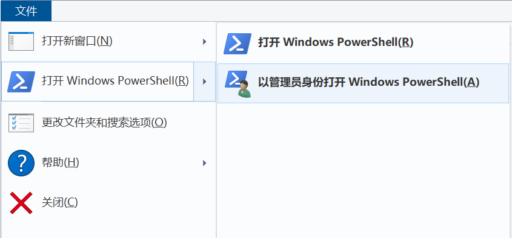
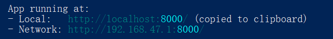

# SmartHomePro

支持语音识别的，环境温湿度和光强检测的智能家居系统。

节点端程序：STM32-AliyunIoT-Paho_RT；后端程序：device-admin；前端程序：front-end。

# 节点端与阿里云

### 阿里云部分

1. 新建标准产品，节点类型选择直连设备，连网方式选择Wi-Fi；

2. 在产品下添加设备；

3. 在产品下添加自定义Topic：

   | Topic_name        | 操作权限 |
   | ----------------- | -------- |
   | lightThresholdSet | 订阅     |
   | clearAlarm        | 订阅     |
   | tempThreshold     | 订阅     |
   | tempHumUpload     | 发布     |
   | tempAlarm         | 发布     |

### 节点端部分

1. 将原件连接到STM32指定的接口；
2. 如果想启用语音识别模块，需要首先向LD3320中烧录`\LD3320(BroJ)\obj\`下的.hex文件；
3. 用IAR打开工程，烧录运行。

# 后端部分

### 软件环境

- JDK8
- MySQL8

### 使用步骤

1. 运行`\device-admin\src\main\resources\schema\`路径下的device-admin.sql，新建三张表；
2. 开启阿里云服务端订阅；
3. 根据注释修改application.property；
4. 待pos.xml依赖下载完毕后，运行SpringBoot应用。

# 前端部分

### 环境搭建

​	安装Node.js环境：Node.js先下载地址：https://nodejs.org/zh-cn/

​	安装yarn：命令行执行 npm i yarn tyarn -g

​	安装umi：命令行执行 yarn global add umi

​	安装dva：命令行执行 npm install -g dva

​	安装BizCharts： 命令行执行 yarn add bizcharts  

​								  或者命令行执行 npm install --save bizcharts

​	安装moment.js: 命令行执行 yarn add moment

​								 或者命令行执行 npm install --save moment

​	安装axios: 命令行执行 yarn add axios

​					   或者命令行执行 npm install --save axios

### 使用步骤

​	进入front-end文件夹，打开命令行

1. 命令行执行 yarn

   （安装依赖）

2. 命令行执行 yarn start

   (开启项目)

   

4. 打开网页，输入http://localhost:8000/main

5. 注意网址设置

   在front-end\src\axios\index.js第七行设置const url的“http://10.19.75.185:9099/”部分设置连接的后端的ip地址

6. 如果需要关闭项目，可以在命令行中按ctrl+c

7. 在项目开启时，对代码的修改，都会实时改变正在运行的项目的状态。因此大部分代码修改更新的结果无需重启项目就可以观察到。如果没有观察到期望中的更新结果，可以重启项目再次观察。# SmartHomePro
